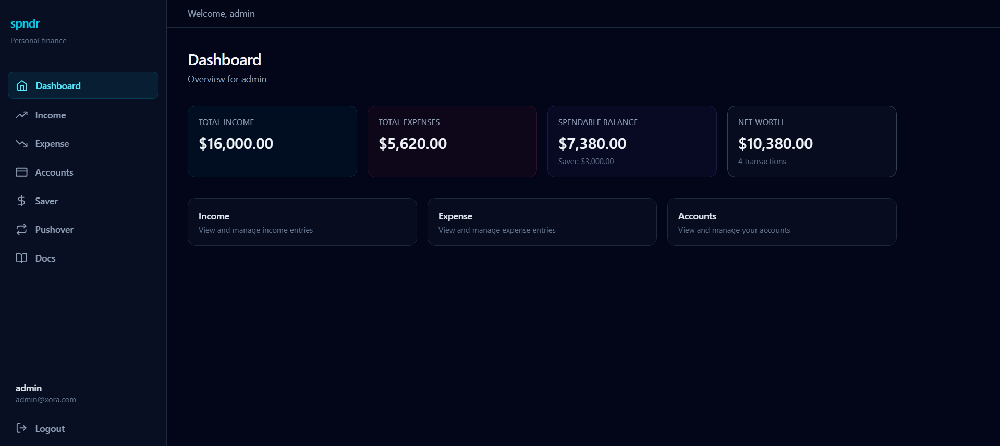
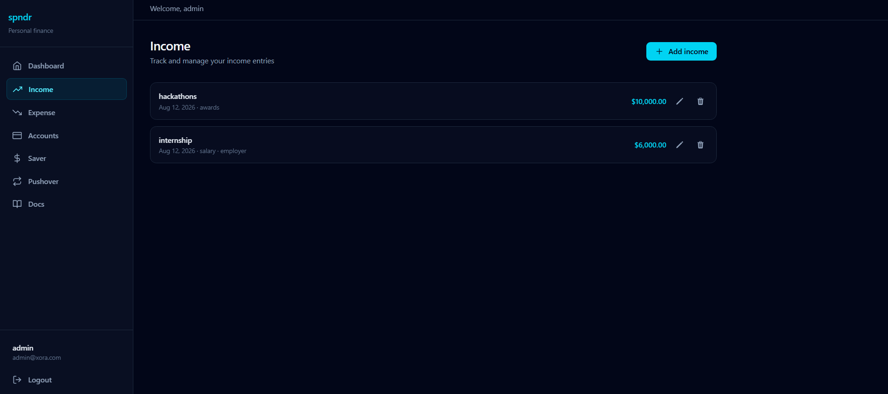
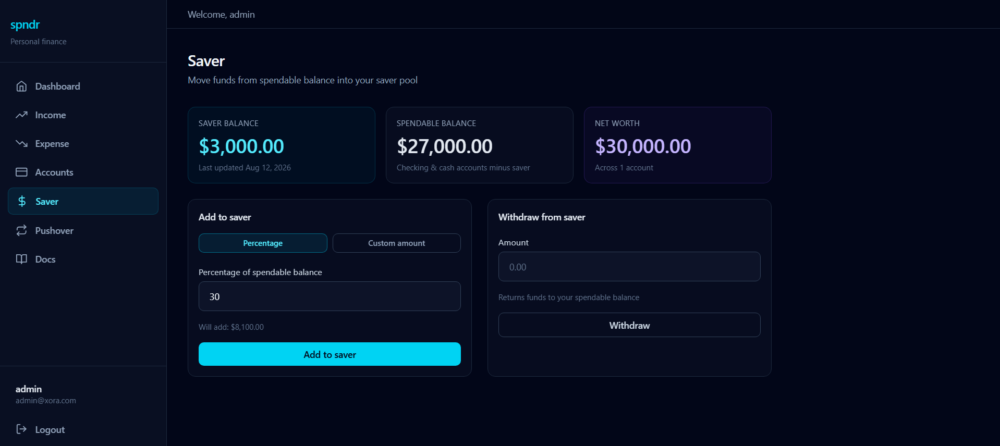
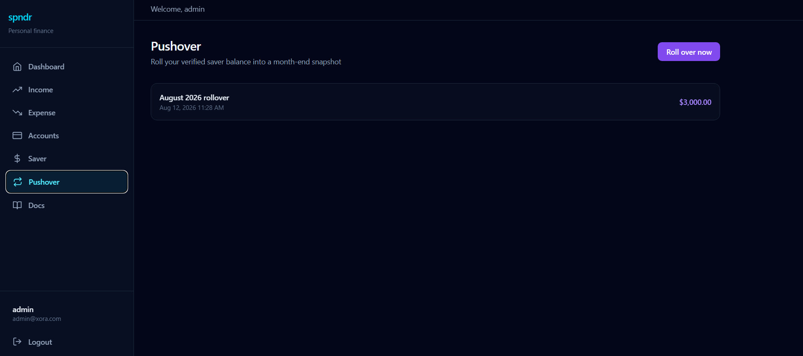

<div align="center">

# spndr

**Personal finance, simplified**
**Track transactions, accounts, budgets, savings goals, and more in one place.**

Built for students and young adults who want clarity over complexity.

[](LICENSE) [](https://github.com/RRI-Atharv37/spndr/releases) [](https://github.com/RRI-Atharv37/spndr/stargazers)


<!-- Hero banner - replace src with your screenshot or GIF -->

<br />

[Quick Start](#-quick-start-3-minute-setup) · [Features](#-key-features) · [Documentation](#-documentation) · [Roadmap](#-roadmap)

</div>

---

## ✨ Key Features

<table>
<tr>
<td width="50%" valign="top">

### Unified Transactions

One ledger for income, expenses, and transfers - with search, date filters, sort, receipt attachments, split expenses, and bulk delete/category actions.

### Multi-Account Tracking

Create checking, cash, credit, and savings accounts. Transaction activity updates balances automatically. Net worth and spendable balance derive from account totals.

### Hierarchical Categories

Nine master categories plus your own sub-categories with icons and colors. Reusable category picker on every transaction form.

### Budgets

Set monthly or custom spending limits - overall or per category - with progress bars, over-budget warnings, and optional account scoping. Posted expenses count toward spent totals; drafts and transfers are excluded.

</td>
<td width="50%" valign="top">

### Savings Goals

Named targets with deadlines, progress metrics, manual contributions, and optional weekly or monthly auto-contributions. Separate from the Saver pool - built for goal tracking, not month-end sweeps.

### Spendable Balance & Net Worth

Dual metrics with smart **Saver pool** math - legacy mode (income − expenses) or **accounts mode** (checking, cash, credit, savings). Spendable balance excludes savings and reflects what you can actually use today.

### Pushover Month-End Rollover

Automated rollover engine snapshots your Saver balance at month-end, resets the pool, and keeps a browsable history - so every month starts clean.

### Battle-Tested Backend

Isolated **Vitest + Supertest** suite with **in-memory MongoDB** - **159 tests** across 21 files covering auth lifecycle, accounts, categories, transactions, budgets, savings goals, transfers, splits, receipts, migration, saver, pushover, and ownership.

</td>
</tr>
</table>

<details>
<summary><strong>Also included in v0.5.0</strong></summary>

- JWT access tokens with refresh rotation (httpOnly cookie), logout-all, and password reset
- Auth rate limiting on login, register, and password reset
- Optional ClamAV virus scan on receipt upload (env-gated)
- Saver deposits by percentage or custom amount, with withdrawal guards
- Transaction API extras - search, timezone-aware date filters, sort, CSV download, duplicate
- Receipt upload (JPEG/PNG/WebP/PDF, 5 MB max) with per-user storage isolation
- Budget progress API - category vs overall scope, split attribution, draft exclusion
- Savings goal lifecycle - pause, resume, complete, archive, contribution timeline
- Legacy data migration CLI (`npm run migrate:transactions`) from Income/Expense to Transaction
- Compound database indexes and production-safe error handling
- Modern dark UI - React 19, Vite 6, Tailwind CSS 4, responsive sidebar, settings modal, toast feedback

</details>

---

## Screenshots

<!-- Replace placeholder paths when assets are ready -->

### Dashboard

<p align="center">
  
  <br />
  <em>Summary cards & quick links to Transactions, Budgets, Savings Goals, and Accounts</em>
</p>

### Accounts

<p align="center">
  
  <br />
  <em>Multi-account balances - checking, cash, credit, and savings</em>
</p>

### Transactions (unified ledger)

<p align="center">
  
  <br />
  <em>Unified income, expense, and transfer ledger (legacy income screenshot)</em>
</p>

### Saver

<p align="center">
  
  <br />
  <em>Allocate from spendable balance by percentage or custom amount</em>
</p>

### Pushover

<p align="center">
  
  <br />
  <em>Month-end rollover with snapshot history</em>
</p>

---

## 🛠 Tech Stack

| Layer | Technologies |
| :--- | :--- |
| **Backend** |       |
| **Frontend** |     |

---

## Quick Start (3-Minute Setup)

### Prerequisites

| Tool | Version |
| :--- | :--- |
| [Node.js](https://nodejs.org/) | 18+ |
| [MongoDB](https://www.mongodb.com/) | 6+ |
| npm | Included with Node.js |

### 1 · Clone & install

```bash
git clone https://github.com/RRI-Atharv37/spndr.git
cd spndr

# Backend
cd backend && npm install

# Frontend (new terminal)
cd frontend/spndr && npm install
```

### 2 · Configure environment

**Backend** - create `backend/.env`:

```env
PORT=5000
MONGO_URI=mongodb://127.0.0.1:27017/spndr
JWT_SECRET=replace-with-a-long-random-string
JWT_EXPIRY=15m
JWT_REFRESH_EXPIRY=7d
CLIENT_URL=http://localhost:5173
```

**Frontend** - copy the example file:

```bash
cp frontend/spndr/.env.example frontend/spndr/.env
```

Default `VITE_API_URL` points to `http://localhost:5000/api/v1`.

### 3 · Run everything

```bash
# Terminal 1 - API (from backend/)
npm run dev

# Terminal 2 - App (from frontend/spndr/)
npm run dev
```

Open **[http://localhost:5173](http://localhost:5173)** → sign up → explore the dashboard.

<details>
<summary><strong>Optional: migrate legacy data, docs site & tests</strong></summary>

```bash
# Migrate legacy Income/Expense to Transactions (from backend/)
npm run migrate:transactions:dry-run   # preview
npm run migrate:transactions           # apply

# Documentation (from docs/) - http://localhost:5174
cd docs && npm install && npm run dev

# Backend tests (from backend/)
npm test
```

</details>

---

## 📖 Documentation

> **Full guides, architecture notes, and API specs live in the docs site - not in this README.**

<table>
<tr>
<td>

### [Browse the Docs Site](http://localhost:5174)

Run locally with `npm run dev` inside [`./docs`](./docs). Covers:

- Getting started & installation
- Dashboard, Transactions, Categories, Accounts, Budgets, Savings Goals, Saver, Pushover
- Authentication - sign-in, password reset, sessions, account settings
- Balance calculation deep-dives
- Complete REST API reference (`/api/v1`) including transactions, budgets, savings goals, categories, and receipts

</td>
<td align="center" width="120">

<br />

[Get Started →](http://localhost:5174/getting-started/introduction)

</td>
</tr>
</table>

Source lives in [`./docs`](./docs) (VitePress). Build for production with `npm run build` inside that folder.

---

## Roadmap

| Phase | Focus | Status |
| :--- | :--- | :--- |
| **Phase 0** | Foundation - auth, CRUD, Saver, Pushover, test infra, dark UI | ✅ **Complete** · `v0.1.0` |
| **Phase 1a** | Accounts - multi-account tracking, balance integration | ✅ **Complete** `v0.2.1` |
| **Phase 1b** | Categories - master seed, sub-categories, dashboard UI | ✅ **Complete** `v0.2.2` |
| **Phase 1c** | Unified transactions - migration, transfers, splits, receipts, bulk ops | ✅ **Complete** · `v0.2.3` |
| **Phase 2** | Auth lifecycle - refresh tokens, logout-all, password reset, ClamAV | ✅ **Complete** `v0.3.0` |
| **Phase 3** | Budgets - CRUD API, progress tracking, UI | ✅ **Complete** `v0.4.0` |
| **Phase 4** | Savings goals - CRUD API, contributions, auto-contribute, UI | ✅ **Complete** · `v0.5.0` |
| **Phase 5** | Recurring transactions & bill drafts | 🔜 **Up next** |

Phases **0–4** are complete with **159 backend tests**. Phase 5 adds recurring rules that generate draft transactions only.

---

## 📄 License & Author

Copyright © 2026 **[Atharv Dewangan](https://github.com/RRI-Atharv37)**

Licensed under the [Apache License 2.0](LICENSE).

---

<div align="center">

**[⭐ Star this repo](https://github.com/RRI-Atharv37/spndr)** if spndr helps you stay on top of your money.

</div>

## Repo Activity

