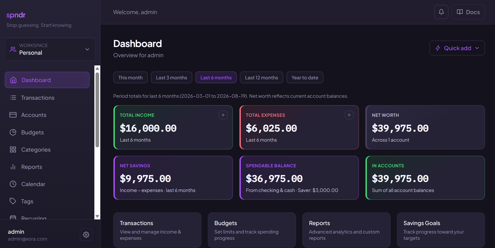
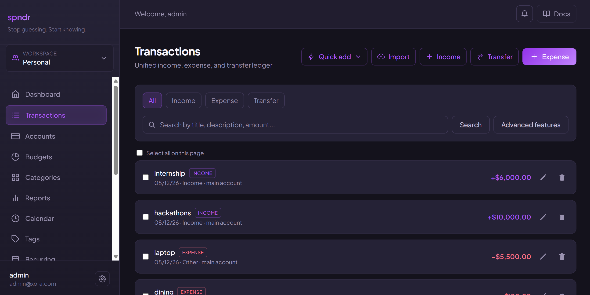
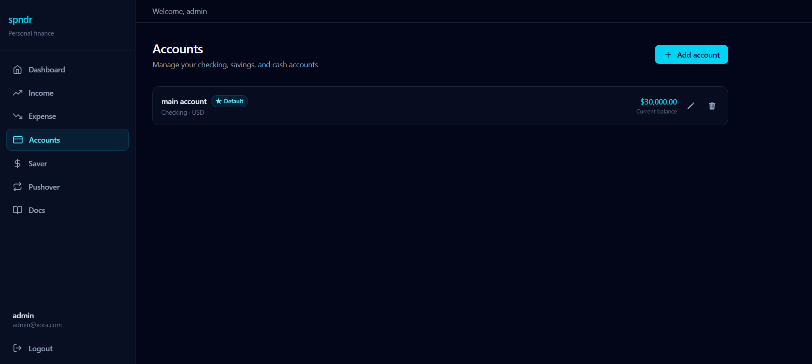
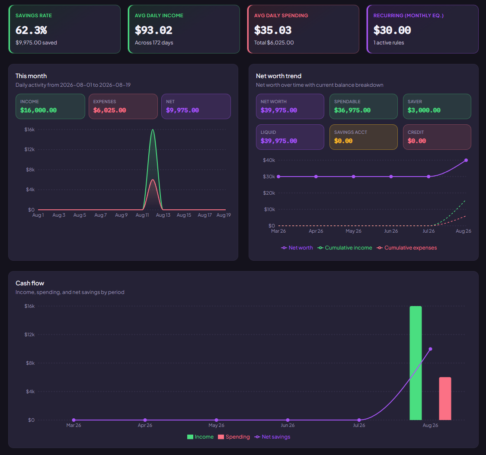

<div align="center">

# Corvale

**Personal finance, simplified**
**Track transactions, accounts, budgets, savings goals, and more in one place.**

Built for students and young adults who want clarity over complexity.

[](LICENSE) [](https://github.com/RRI-Atharv37/corvale/releases) [](https://github.com/RRI-Atharv37/corvale/stargazers)


<!-- Hero banner - replace src with your screenshot or GIF -->

<br />

[Quick Start](#-quick-start-3-minute-setup) · [Features](#-key-features) · [Screenshots](#-screenshots) · [Documentation](#-documentation)

</div>

---

## ✨ Key Features

<table>
<tr>
<td width="50%" valign="top">

### Unified Transactions

One ledger for income, expenses, and transfers - with search, date filters, sort, receipt attachments, split expenses, structured [tags](docs/tags/overview.md), and bulk delete/category actions. Import historical transactions from a bank CSV/OFX/QFX file with automatic duplicate detection.

### Multi-Account Tracking

Create checking, cash, credit, and savings accounts. Transaction activity updates balances automatically. Net worth and spendable balance derive from account totals. **Reconcile** any account against a bank statement, and view **converted balances** across accounts held in different currencies.

### Hierarchical Categories & Automation

Nine master categories plus your own sub-categories with icons and colors. **Auto-categorization rules** assign a category (and tags) to matching transactions on creation - test a rule before saving it, or bulk-apply rules to your existing history.

### Budgets

Set monthly or custom spending limits - overall or per category - with progress bars, over-budget warnings, and optional account scoping. Posted expenses count toward spent totals; drafts and transfers are excluded.

### Recurring Rules & Draft Inbox

Schedule repeating income and bills (daily through yearly, or a custom interval). Rules generate **draft transactions** for review - nothing posts or touches your balance until you confirm it - plus a calendar view of upcoming due dates.

### Bank Import & Backup/Restore

Import a bank statement with a guided mapping + duplicate-resolution wizard. Export a full JSON or ZIP (with receipts) backup of your data at any time and restore it later - restores always create fresh records, never overwrite.

</td>
<td width="50%" valign="top">

### Savings Goals

Named targets with deadlines, progress metrics, manual contributions, and optional weekly or monthly auto-contributions. Separate from the Saver pool - built for goal tracking, not month-end sweeps.

### Spendable Balance & Net Worth

Dual metrics with smart **Saver pool** math - legacy mode (income − expenses) or **accounts mode** (checking, cash, credit, savings). Spendable balance excludes savings and reflects what you can actually use today.

### Reports & Analytics

Charts for spending trends, income vs. expense, savings rate, largest expenses, and more, plus a **custom report builder** (split by category/time/payment method, choose a chart type) and **saved reports** you can re-run anytime.

### Tags & Quick-Add Templates

Attach colored, renameable tags across transactions, recurring rules, and templates for cross-cutting labels categories don't cover. Save a **quick-add template** for anything you log often and create it in one click from Home or Transactions.

### Workspaces & Collaboration

Share accounts, transactions, budgets, savings goals, and recurring rules with a household or roommates. Invite members as **editor** or **viewer**, switch scope from a sidebar dropdown, and keep personal data completely separate.

### In-App Notifications & Onboarding

A notification center flags over-budget spending, bills due soon, savings milestones, and workspace invites. New users are walked through a short **onboarding wizard** (first account, categories, a starter budget and goal) - replayable anytime from Settings.

### Financial Planning Tools

A cash flow **forecast** projects account balances 30/60/90 days out from recurring bills, goal contributions, and average discretionary spending, with low-balance warnings. A unified **calendar** shows bill due dates, budget period ends, and savings goal deadlines in one month view. Track **subscriptions** with monthly/annual cost totals and a one-click cancel/reactivate toggle. Build a **debt payoff plan** (snowball or avalanche) for credit accounts with configurable APR and minimum payment.

### Pushover Month-End Rollover

Automated rollover engine snapshots your Saver balance at month-end, resets the pool, and keeps a browsable history - so every month starts clean.

### Battle-Tested Backend

Isolated **Vitest + Supertest** suite with **in-memory MongoDB** - **480 tests** across 41 files covering auth lifecycle, accounts, categories, transactions, budgets, savings goals, recurring rules, workspaces, tags, categorization rules, import/export, reconciliation, multi-currency, onboarding, and more.

</td>
</tr>
</table>

<details>
<summary><strong>Also shipped</strong></summary>

- Manual currency exchange rates (`/api/v1/exchange-rates`) power converted account balances
- JWT access tokens with refresh rotation (httpOnly cookie), logout-all, and password reset
- Auth rate limiting on login, register, and password reset
- Optional ClamAV virus scan on receipt upload (env-gated)
- Legacy Income/Expense routes kept for backward compatibility and migration (`npm run migrate:transactions`)
- Modern dark UI - React 19, Vite 6, Tailwind CSS 4, responsive sidebar, settings modal, toast feedback

</details>

---

## 📸 Screenshots

<!-- Replace placeholder paths when assets are ready -->

### Dashboard

<p align="center">
  
  <br />
  <em>Summary cards & quick links to Transactions, Budgets, Reports, Savings Goals, Recurring, and Accounts</em>
</p>

### Transactions

<p align="center">
  
  <br />
  <em>Unified ledger for income, expenses, and transfers</em>
</p>

### Accounts

<p align="center">
  
  <br />
  <em>Multi-account balances - checking, cash, credit, and savings</em>
</p>

### Reports

<p align="center">
  
  <br />
  <em>Advanced Reports Generation including custom reports</em>
</p>

---

## 🛠 Tech Stack

| Layer | Technologies |
| :--- | :--- |
| **Backend** |       |
| **Frontend** |     |
| **Docs** |  |

---

## Quick Start (3-Minute Setup)

### Prerequisites

| Tool | Version |
| :--- | :--- |
| [Node.js](https://nodejs.org/) | 18+ |
| [MongoDB](https://www.mongodb.com/) | 6+ |
| npm | Included with Node.js |

### 1 · Clone & install

```bash
git clone https://github.com/RRI-Atharv37/corvale.git
cd corvale

# Backend
cd backend && npm install

# Frontend (new terminal)
cd frontend/corvale && npm install
```

### 2 · Configure environment

**Backend** - create `backend/.env`:

```env
PORT=5000
MONGO_URI=mongodb://127.0.0.1:27017/corvale
JWT_SECRET=replace-with-a-long-random-string
JWT_EXPIRY=15m
JWT_REFRESH_EXPIRY=7d
CLIENT_URL=http://localhost:5173
```

See [Environment Variables](docs/developers/environment-variables.md) for the full list, including refresh-token, rate-limit, and receipt virus-scan settings.

**Frontend** - copy the example file:

```bash
cp frontend/corvale/.env.example frontend/corvale/.env
```

Default `VITE_API_URL` points to `http://localhost:5000/api/v1`.

### 3 · Run everything

```bash
# Terminal 1 - API (from backend/)
npm run dev

# Terminal 2 - App (from frontend/corvale/)
npm run dev
```

Open **[http://localhost:5173](http://localhost:5173)** → sign up → the onboarding wizard walks you through creating your first account.

<details>
<summary><strong>Optional: migrate legacy data, docs site & tests</strong></summary>

```bash
# Migrate legacy Income/Expense to Transactions (from backend/)
npm run migrate:transactions:dry-run   # preview
npm run migrate:transactions           # apply

# Documentation (from docs/) - http://localhost:5174
cd docs && npm install && npm run dev

# Backend tests (from backend/)
npm test
```

</details>

---

## 📖 Documentation

> **Full guides, architecture notes, and API specs live in the docs site - not in this README.**

<table>
<tr>
<td>

### [Browse the Docs Site](http://localhost:5174)

Run locally with `npm run dev` inside [`./docs`](./docs). Covers:

- Getting started, installation & onboarding
- Dashboard, Transactions, Recurring, Categories, Tags, Accounts, Budgets, Savings Goals, Saver, Pushover
- Reports & custom report building, Notifications, Workspaces & permissions
- Bank import, backup & restore, account reconciliation, multi-currency balances
- Authentication - sign-in, password reset, sessions, account settings
- Balance calculation deep-dives
- Complete REST API reference (`/api/v1`) - every route above, plus forecast, calendar, subscriptions, and debt payoff

</td>
<td align="center" width="120">

<br />

[Get Started →](http://localhost:5174/getting-started/introduction)

</td>
</tr>
</table>

Source lives in [`./docs`](./docs) (VitePress). Build for production with `npm run build` inside that folder.

Phases **0–12** are complete with **480 backend tests** across 41 files, zero regressions. See [ROADMAP.md](./ROADMAP.md) for the full phase-by-phase roadmap and architectural detail.

---

## 📄 License & Author

Copyright © 2026 **[Atharv Dewangan](https://github.com/RRI-Atharv37)**

Licensed under the [GNU Affero General Public License v3.0](LICENSE) (`AGPL-3.0-or-later`).

> **v1.0.0 is the first AGPL release.** Every earlier release — up to and including **v0.17.0**
> — was published under the Apache License 2.0, and that grant is irrevocable for those
> versions.

---

<div align="center">

**[⭐ Star this repo](https://github.com/RRI-Atharv37/corvale)** if Corvale helps you stay on top of your money.

</div>

## Repo Activity

