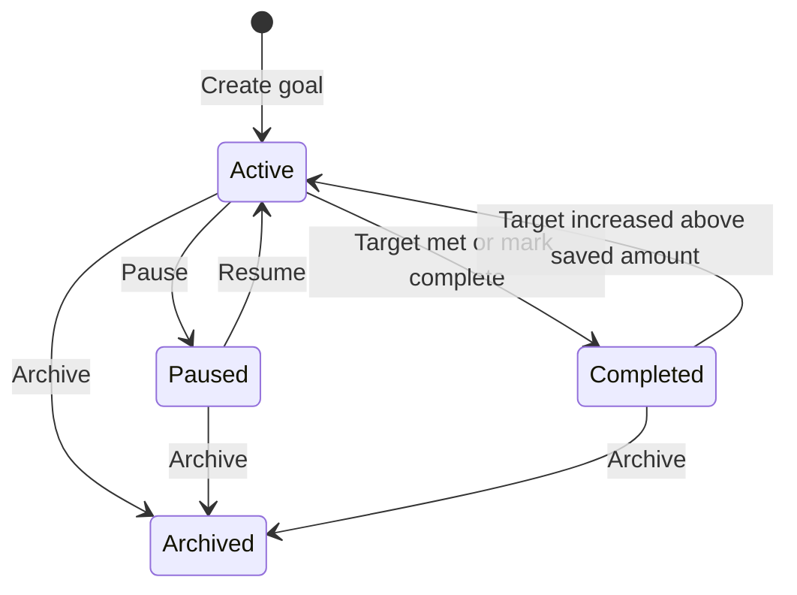

## Manage active, paused, completed, and archived goals

Savings goals move through a simple lifecycle. You control when to pause saving, mark a goal complete, or archive it for long-term reference.

## Status transitions

## Pause and resume

### Pause

Use **Pause** when you want to stop contributions temporarily:

1. Click the **pause** icon on an active goal card.
2. Confirm in the dialog.

Paused goals show an amber status badge. Manual and automatic contributions are blocked until you resume.

### Resume

Click the **play** icon on a paused goal to return it to **Active** status. Contributions become available again.

## Mark complete

You can complete a goal in two ways:

1. **Automatically** - when contributions reach or exceed the target amount
2. **Manually** - click the **checkmark** icon and confirm

Completed goals show a green status badge and move to the **Completed** tab. You cannot add contributions to completed goals unless you edit the target upward (which may reopen the goal).

## Archive

Archive goals you no longer need on the active list:

1. Click the **trash** icon on a goal card.
2. Confirm in the dialog.

Archived goals appear on the **Archived** tab when you include archived items in the list filter. Archiving is soft-delete - data is retained but hidden from default views.

## Tab views

| Tab | Goals shown |
|-----|-------------|
| **Active** | Goals with status **Active** or **Paused** |
| **Completed** | Goals with status **Completed** |
| **Archived** | Goals with status **Archived** |

Switch tabs at the top of the Savings Goals page to change the view.

## Progress bar states

The progress bar color reflects completion:

- **Indigo / violet / cyan** - in progress
- **Emerald** - target reached (100% or complete)

Paused goals keep their progress but use an amber card accent. Completed goals use an emerald card accent.

## Related pages

- [Savings Goals Overview](./overview.md)
- [Contributing to Goals](./contributing-to-goals.md)
- [Creating a Savings Goal](./creating-a-savings-goal.md)
